[]() 

# Discord Dice UI

🎲 **The app is intended to use as a graphical interface dice roller for Discord. You can connect it with your Discord chat and use it to roll some dice without typing!** 🎲

> Table of content: 
> 
> - [The App Overview](#overview)
>     * Supported Systems:
>         + [Call of Cthulhu 7e](#call-of-cthulhu)
>         + [Warhammer](#warhammer)
>         + [Conan 2d20](#conan-2d20)
>         + [Infinity 2d20](#infinity-2d20)
>         + [Legend of the Five Rings 1e](#l5r1e)
>         + [Legend of the Five Rings 5e](#l5r5e)    
>         + [Narrative Dice](#narrative-dice)    
>         + [Fate](#fate)    
> - [Discord Configuration](#discord-configuration)
> - [Query parameters](#query-params)
> - [Developers' Info](#dev-info)

## The App Overview <a id="overview"></a>

The App interface:  
[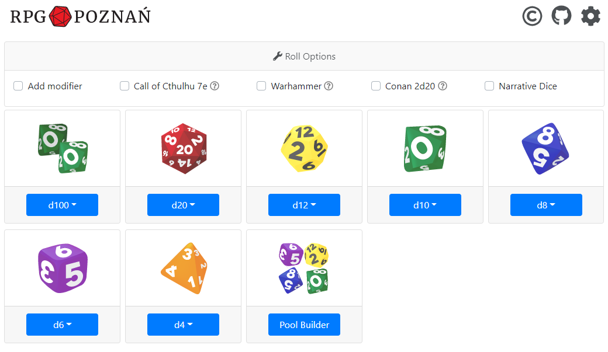]()

Sample results inside a Discord Chat:  
[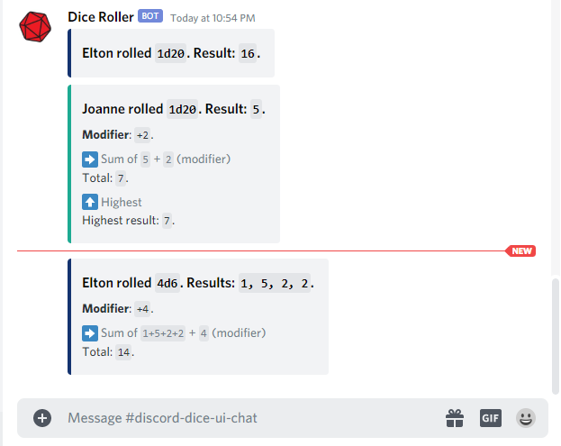]()

Sample results inside the App:  
[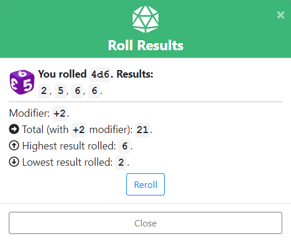]()

## Call of Cthulhu 7e <a id="call-of-cthulhu"></a>

After selecting the mode in the _Roll Options_ a dedicated modal will be shown for rolling d100 skill tests - with option to Push the roll and guidelines for optional spending luck.

[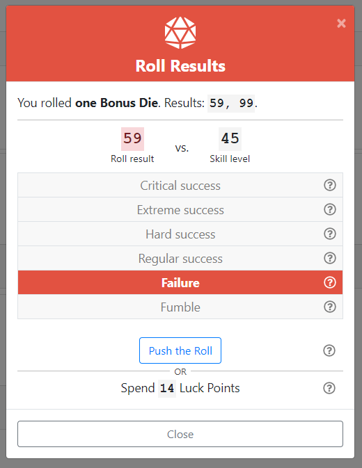]()

Skill values can be stored in build-in character sheet:

[]()

[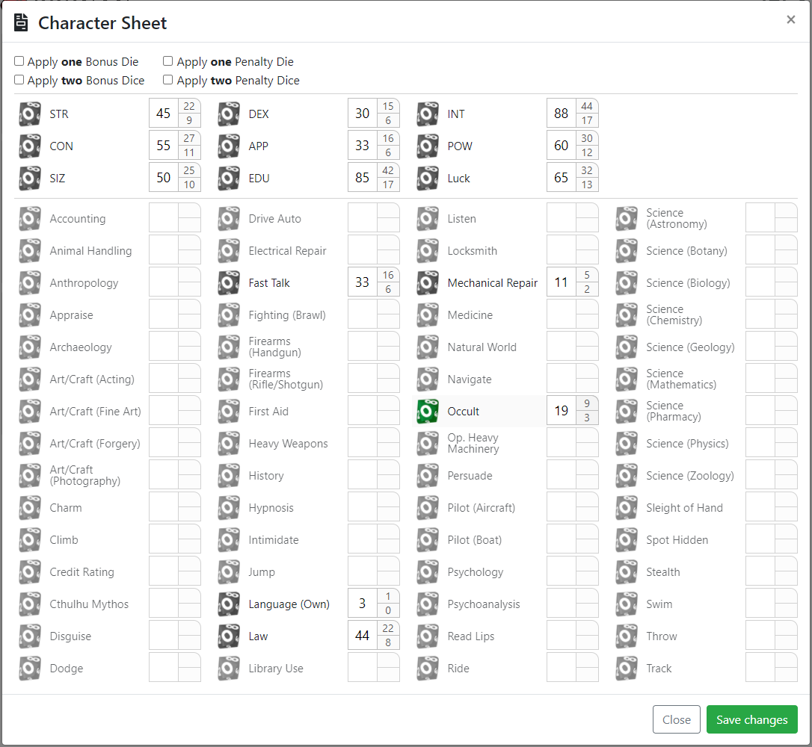]()

## Warhammer <a id="warhammer"></a>

The app offers special support for rolling Success Levels in Warhammer 2e, Warhammer 4e and Dark Heresy II.

[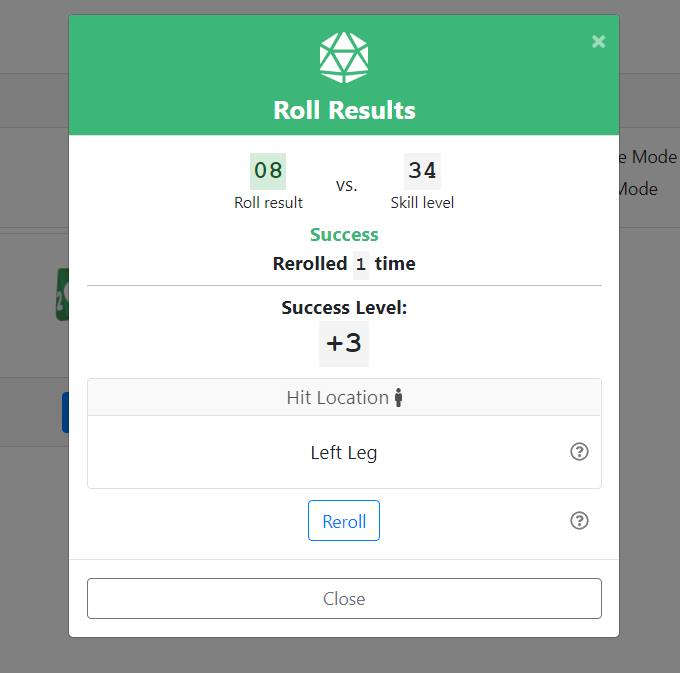]()

The app can also help with adding and subtracting gold crowns, silver shillings and brass pennies:

[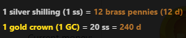]()

[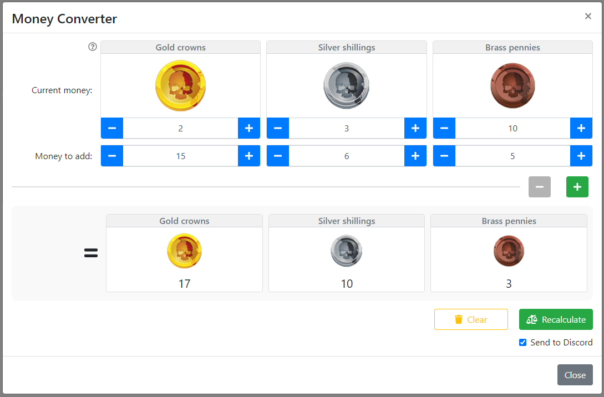]()

## Conan 2d20 <a id="conan-2d20"></a>

This mode adds special modal for testing abilities, generating Hit Location and rolling Combat Dice:

[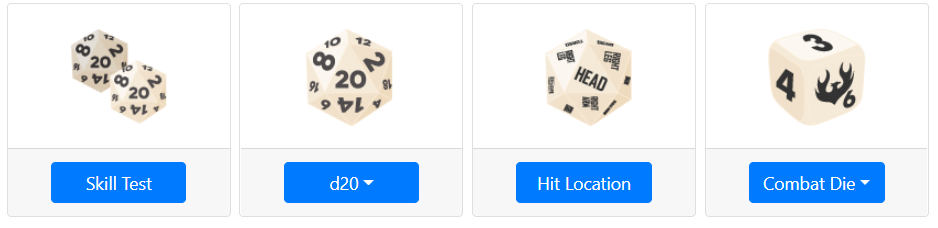]()

In the modal one can define Focus, Target Number, Difficulty, select amount of dice rolled, focus and so on:

[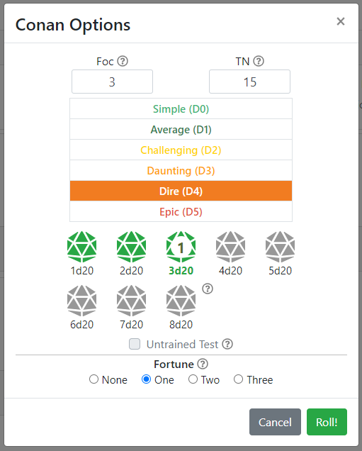]()

Damage Dice Result (with option to reroll selected dice):

[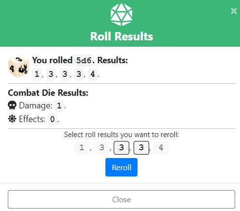]()

## Infinity 2d20 <a id="infinity-2d20"></a>

[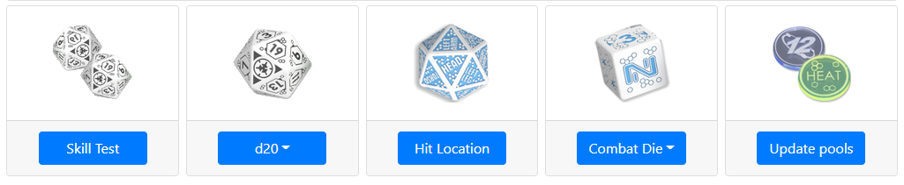]()

## Legend of the Five Rings 1e (classical Roll and Keep) <a id="l5r1e"></a>

Roll and Keep Results:  
[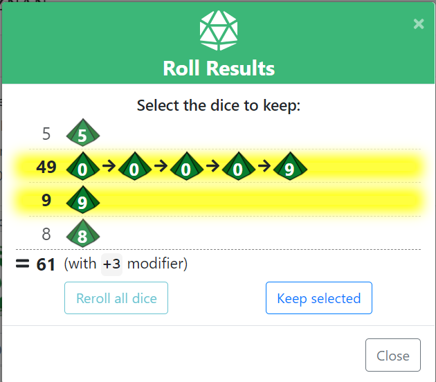]()

## Legend of the Five Rings 5e <a id="l5r5e"></a>

Allows to roll Skill and Ring Dice and to modify the results:  
[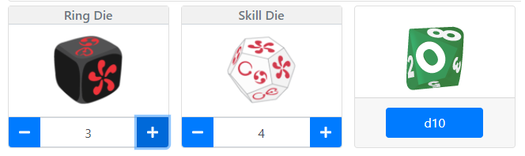]()

Roll Results:  
[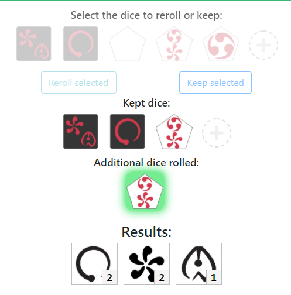]()

## Narrative Dice <a id="narrative-dice"></a>

Allows to build a custom dice pull from popular space opera RPG series:  
[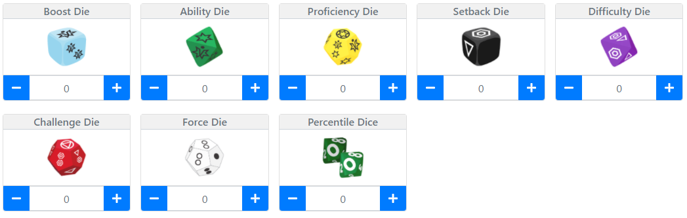]()

Roll Results:  
[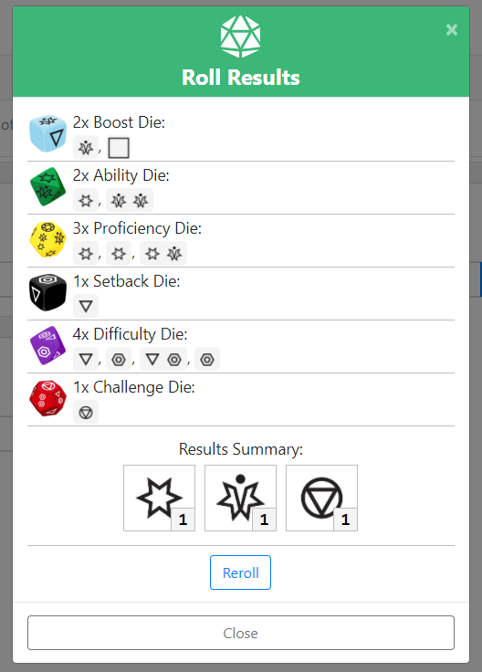]()

## Fate <a id="fate"></a>

[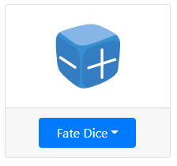]()
--------------------------------------------

## Discord Configuration <a id="discord-configuration"></a>

In order to get started, **Discord's server admin has to create a Webhook** and share a special link with other users. Read below how to do it.

1. As a server's admin open your chat's context menu.
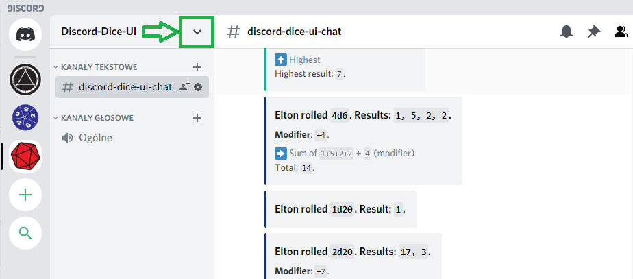

2. Select _Server Settings_ from the context menu.
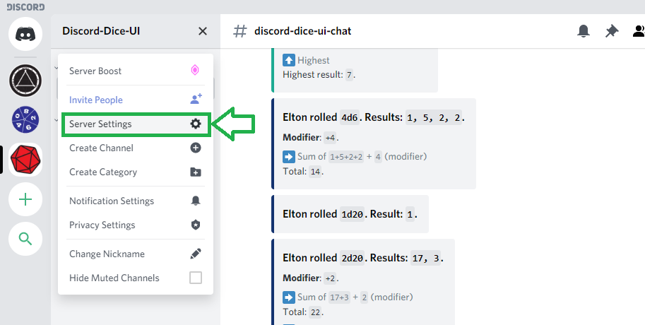

3. Select _Webhooks_ in the left side menu and then press the button _Create Webhook_.
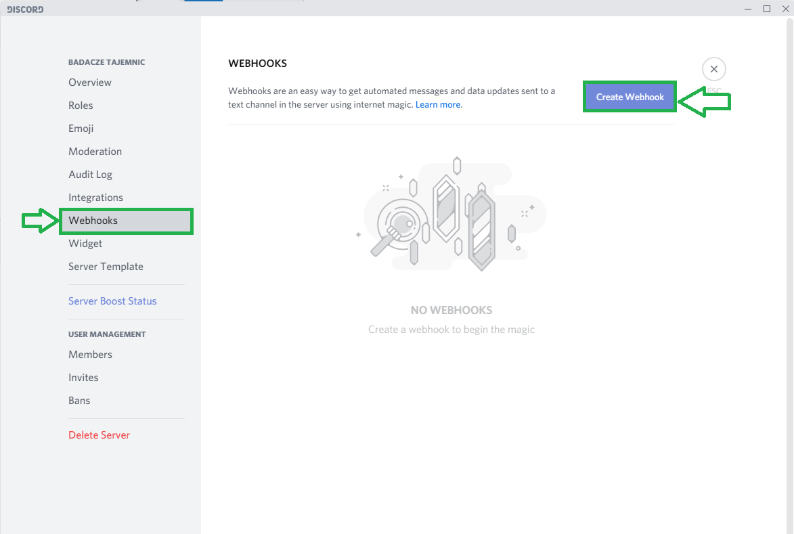

4. Name your Webhook and provide an icon (optionally). **Copy a link** to obtain your unique Webhook url and press **Save** button to close the modal.
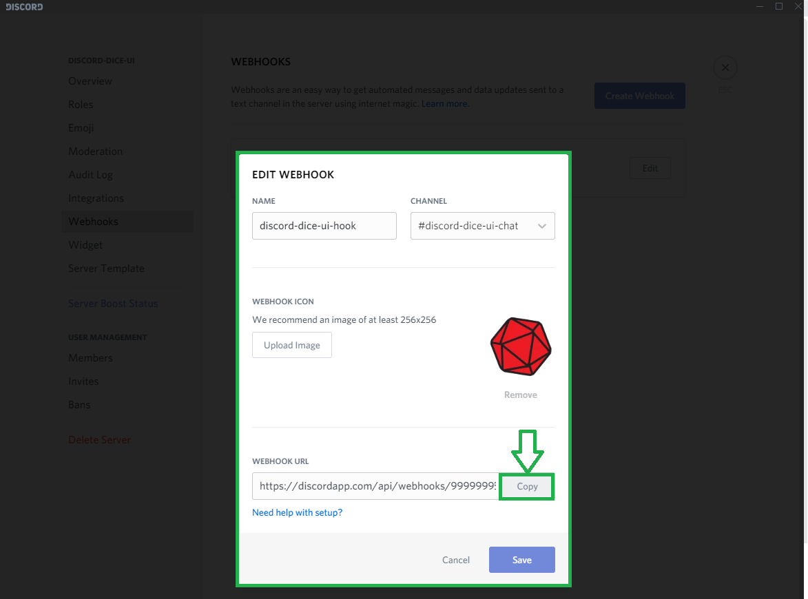
🛑 **Never share your Webhook link publicly and keep it a secret. You don't want to allow strangers to publish messages in your chat.**   

5. Now you can share the Webhook url with other players in two ways:
    1. **Via link param**.  
    Provide your players a link to an app which looks like this:
    ```
    https://discord-dice-ui.herokuapp.com/?q=UNIQUE_CODE_FROM_YOUR_DICORD_WEBHOOK
    ```

    > 💡 **HINT**: You can generate the link using _Copy App Link_ button in the Setting Modal:
    >
    > 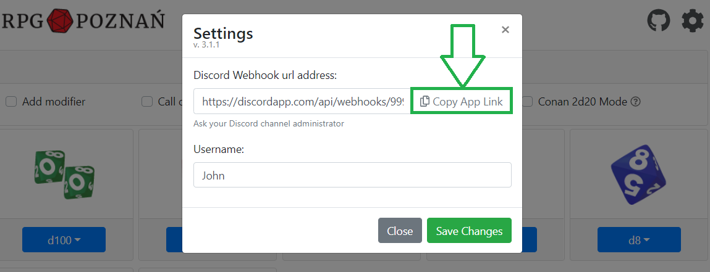

    2. **Manually**.  
    Alternatively, every user has to enter the provided Webhook link url in the Settings modal inside the app. Entering the username is required as well.
    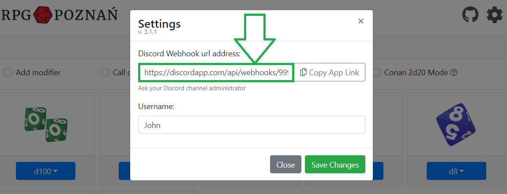

6. Saving the Webhook in the app will connect the app with the Discord server.

--------------------------------------------

## Query Parameters <a id="query-params"></a>
Several settings can by passed directly in the URL in the following format:
<pre xmlns="http://www.w3.org/1999/html">
discord-dice-ui.herokuapp.com/<font color="green"><b>?q=</b></font>foo123<b><font color="orange">&username=</font></b>Django<b><font color="blue">&sl=</b></font>fast
</pre>
Available parameters:
-  `q` - Discord Webhook URL
-  `username` - Discord UI Username
- `sl` - Warhammer Success Level calculation method. Available values:
  - `4e` for default Warhammer 4e Success Level
  - `fast` for Warhammer 4e Fast Success Level
  - `2e` for default Warhammer 2e Degrees of Success
  - `dh` for default Dark Heresy 2e Degrees of Success


--------------------------------------------
## Developers' Info <a id="dev-info"></a>

### Production build

1. `npm run build`.
2. `npm run start` (`serve -s build` command is required by Heroku).

### Development build

1. `npm run dev`.
