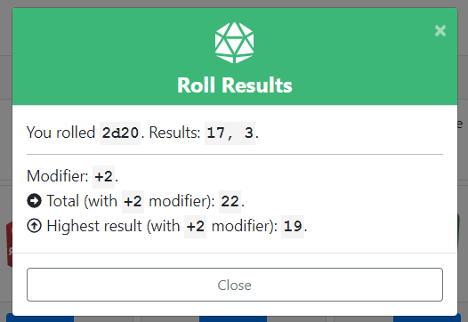
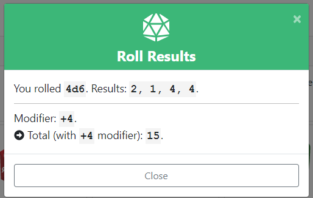
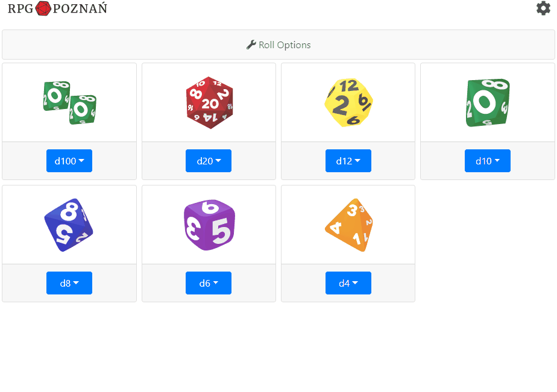

<!--  -->

# Discord Dice UI

> They are plenty of Discord bots that allow you to roll dice in the chat. They're may by great, but I never felt like typing while playing an RPG game. So I created this connector in which you can just select and click a die you want to roll on Discord's chat.

The app is intended to use as a graphical interface dice roller for Discord. You can connect it with your Discord's server and use to roll some dice! 🎲🎲
>
 You can modify how the result is displayed by selecting different _Roll Options_:
- Keep highest
- Keep lowest
- Sum results
- Add modifier
- Call of Cthulhu 7e Mode (read below)

#### App Interface

#### Sample results inside Discord's Chat

#### Sample results inside the App

### Call of Cthulhu 7e Mode

The app offers special support for Call of Cthulhu 7e RPG game. After selecting the mode in the _Roll Options_ a dedicated modal will be shown for rolling d100.

## Setup

In order to get started, **Discord's server admin has to create a Webhook** and share it with other users. Read below how to do it.

1. As a server's admin open your chat's context menu.

2. Select _Server Settings_ from the context menu.

3. Select _Webhooks_ in the left side menu and then press the button _Create Webhook_.

4. Name your Webhook and provide an icon (optionally). **Copy a link** to share the link with other users and press **Save** button to close the modal.

🛑🚧🚧🚧🛑  
**Never share your Webhook link publicly and keep it a secret. You don't want to allow strangers to publish messages in your chat.**  
🛑🚧🚧🚧🛑  

5. Every user has to enter the provided Webhook link url in the Settings modal inside the app. Entering the username is required as well.

6. Saving the Webhook in the app will connect the app with the Discord's server.

## Demo preview:

