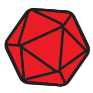
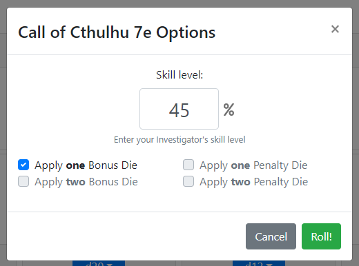
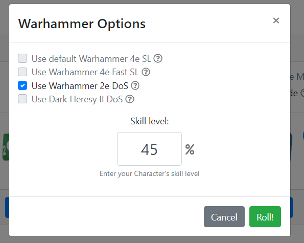
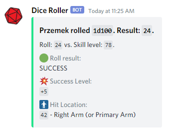
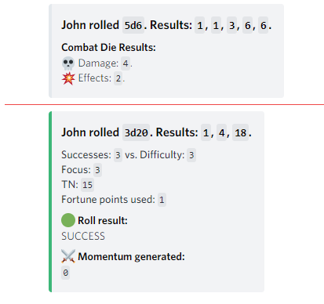
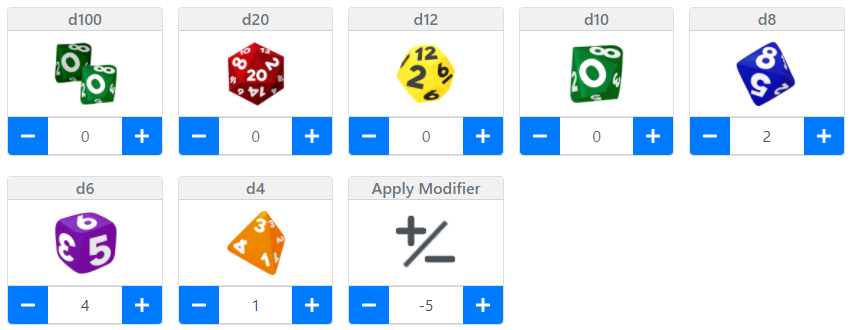

# Discord Dice UI

> 🎲 The app is intended to use as a graphical interface dice roller for Discord. You can connect it with your Discord chat and use to roll some dice without typing!

The app offers special support for following games:
- Call of Cthulhu 7e
- Warhammer (Dark Heresy II, WFRP 2e/4e)
- Conan 2d20
- Narrative Dice (EotE SW)

[]()

### Sample results inside Discord's Chat
[]()

### Sample results inside the App
[]()

-----------------------------
## Call of Cthulhu 7e Mode

After selecting the mode in the _Roll Options_ a dedicated modal will be shown for rolling d100 skill tests - with option to Push the roll and guidelines for optional spending luck.

[]()

[]()

-----------------------------
## Warhammer Mode

The app offers special support for rolling Success Levels in Warhammer 2e, Warhammer 4e and Dark Heresy II.

[]()

[]()

[]()

-----------------------------
## Conan 2d20 Mode

This mode adds special modal for testing abilities, generating Hit Location and rolling Combat Dice:

[]()

In the modal one can define Focus, Target Number, Difficulty, select amount of dice rolled, focus and so on:

[]()

Damage Dice Result (with option to reroll selected dice):

[]()

And the results in Discord Chat:

[]()

-----------------------------
## Pool Builder

Allows to roll different die types at once.

[]()

-----------------------------
## Narrative Dice

Allows to build a custom dice pull from popular space opera RPG series.

[]()

[]()

-----------------------------
## Setup

In order to get started, **Discord's server admin has to create a Webhook** and share a special link with other users. Read below how to do it.

1. As a server's admin open your chat's context menu.


2. Select _Server Settings_ from the context menu.


3. Select _Webhooks_ in the left side menu and then press the button _Create Webhook_.


4. Name your Webhook and provide an icon (optionally). **Copy a link** to obtain your unique Webhook url and press **Save** button to close the modal.

🛑 **Never share your Webhook link publicly and keep it a secret. You don't want to allow strangers to publish messages in your chat.**   

5. Now you can share the Webhook url with other players in two ways:
    1. **Via link param**.  
    Provide your players a link to an app which looks like this:
    ```
    https://discord-dice-ui.herokuapp.com/?q=UNIQUE_CODE_FROM_YOUR_DICORD_WEBHOOK
    ```

    > 💡 **HINT**: You can generate the link using _Copy App Link_ button in the Setting Modal:
    >
    > 

    2. **Manually**.  
    Alternatively, every user has to enter the provided Webhook link url in the Settings modal inside the app. Entering the username is required as well.
    

6. Saving the Webhook in the app will connect the app with the Discord server.

-----------------------------
## Developers' info

### Production build

1. `npm run build`.
2. `npm run start` (`serve -s build` command is required by Heroku).

### Development build

1. `npm run dev`.
